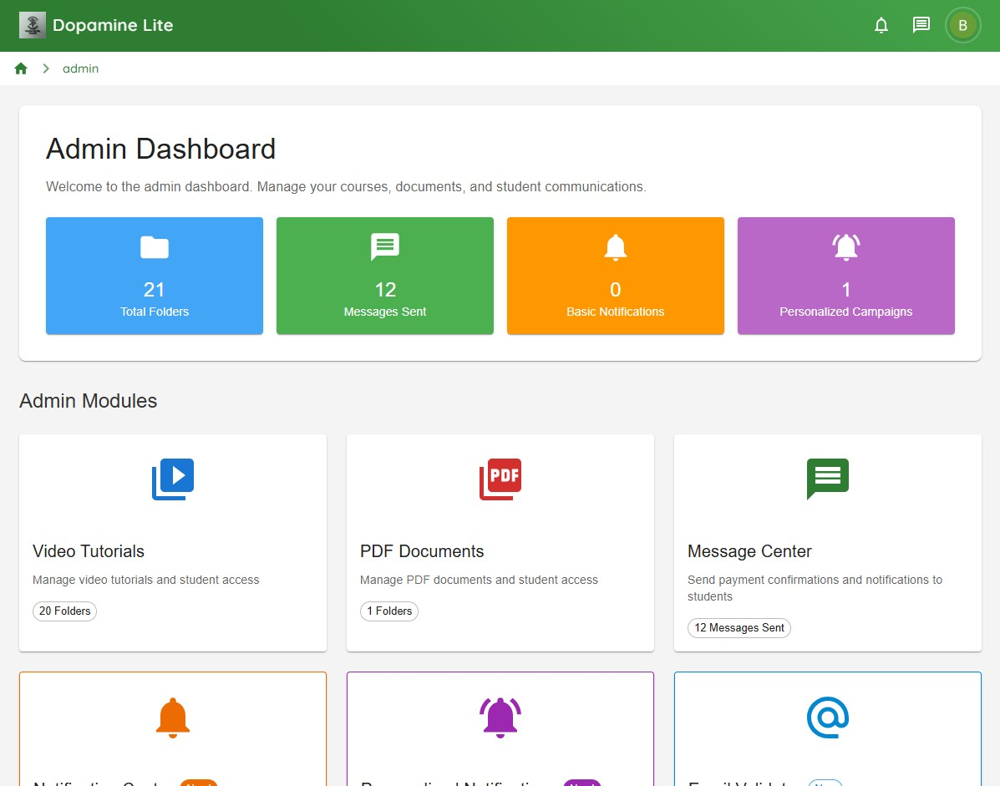

# Dopamine Lite - Educational Content Delivery Platform

### Dopamine Lite Student Interface

*The web-based interface for uploading, processing, and managing PDF watermarks*
### Dopamine Lite Admin Interface

*The web-based interface for uploading, processing, and managing PDF watermarks*

## 📋 Table of Contents
- [Overview](#overview)
- [Features](#features)
- [Live Demo](#live-demo)
- [Architecture](#architecture)
- [Technologies](#technologies)
- [Getting Started](#getting-started)
- [Project Structure](#project-structure)
- [Firebase Configuration](#firebase-configuration)
- [AWS Integration](#aws-integration)
- [Video Processing Pipeline](#video-processing-pipeline)
- [Video Streaming](#video-streaming)
- [Notification System](#notification-system)
- [Contributing](#contributing)
- [License](#license)

## 🎯 Overview

**Dopamine Lite** is a modern educational content delivery web platform built with React, Firebase, and AWS services. The platform provides efficient distribution of educational videos and materials using **HLS (HTTP Live Streaming)** technology with automated video processing and adaptive quality streaming.

The platform addresses the growing need for accessible educational content by providing:
- **Automated video processing** using AWS Lambda and EC2 for multi-quality conversion
- **Scalable video storage** with Amazon S3 and CloudFront CDN distribution
- **HLS video streaming** with adaptive bitrate and multi-quality playback support
- **PDF document sharing** for educational materials and notes
- **Custom notification system** for real-time updates and announcements
- **Email-based access management** through Firebase Authentication
- **Responsive web design** optimized for all devices
- **Real-time data synchronization** using Firebase Firestore

## ✨ Features

### 🎥 Video Processing & Streaming
- **Automated Video Conversion** - AWS Lambda-triggered processing for multiple quality variants
- **HLS Streaming Technology** - Optimized video content distribution with adaptive bitrate streaming
- **Multi-Quality Support** - Automatic generation of 144p, 360p, 536p, 720p, and 1080p variants
- **CDN Distribution** - Global content delivery using Amazon CloudFront
- **Scalable Storage** - Amazon S3 for reliable video storage and retrieval

### 🔔 Notification System
- **Custom Notification System** - Real-time updates and announcements for users
- **Firebase Cloud Messaging** - Push notifications for web browsers
- **Targeted Messaging** - Customized notifications based on user preferences

### 📄 Content Sharing
- **PDF Notes Sharing** - Upload and share educational PDF materials through Firebase Storage
- **Document Management** - Organize and categorize educational resources
- **File Access Control** - Secure document sharing with permission management

### 🔐 Access Management
- **Firebase Authentication** - Secure email-based user authentication
- **User Permission Management** - Control access to different content and features
- **Real-time User State** - Seamless authentication state management

### 🎨 User Interface
- **Responsive Design** - Mobile-first approach optimized for all screen sizes
- **Modern React Components** - Custom UI components for enhanced user experience
- **Real-time Updates** - Live data synchronization using Firebase Firestore

## 🌐 Live Demo

- **🌍 Web Application**: [dopamineapplite.com](https://dopamineapplite.com/)
- **🎬 Demo Video**: [Watch Full Demo](https://drive.google.com/file/d/1SmbivwtT_hCjtqsUP9HWGDDx3XiJv1uV/view?usp=sharing)

## 🏗️ Architecture

```
┌─────────────────────────────────────────────────────────────┐
│                    Dopamine Lite Web App                    │
│                      (React Frontend)                       │
└─────────────────────────────────────────────────────────────┘
                                │
                ┌───────────────┼───────────────┐
                │               │               │
    ┌─────────────────┐ ┌─────────────────┐ ┌─────────────────┐
    │   Firebase      │ │   AWS Services  │ │   CDN & Cache   │
    │   Services      │ │                 │ │                 │
    └─────────────────┘ └─────────────────┘ └─────────────────┘
                │               │               │
         ┌──────┼──────┐       │        ┌──────┼──────┐
         │      │      │       │        │      │      │
┌─────────────┐ │ ┌─────────────┐ ┌─────────────┐ │ ┌─────────────┐
│  Firebase   │ │ │  Firebase   │ │   Amazon    │ │ │   Amazon    │
│Authentication│ │ │ Firestore   │ │     S3      │ │ │ CloudFront  │
│(Email Auth) │ │ │ (Database)  │ │ (Storage)   │ │ │   (CDN)     │
└─────────────┘ │ └─────────────┘ └─────────────┘ │ └─────────────┘
                │                         │       │
        ┌─────────────┐              ┌─────────────┐
        │  Firebase   │              │    AWS      │
        │   Storage   │              │   Lambda    │
        │  (PDFs)     │              │ (Processing)│
        └─────────────┘              └─────────────┘
                                             │
                                   ┌─────────────┐
                                   │    AWS      │
                                   │     EC2     │
                                   │(Heavy Tasks)│
                                   └─────────────┘
```

### Key Components:

1. **Frontend Layer**
   - React.js application with modern hooks and context
   - Custom UI components for video playback and content management
   - Responsive design with CSS modules/styled components

2. **Authentication & Database Layer**
   - Firebase Authentication for secure email-based login
   - Firebase Firestore for real-time database operations
   - Firebase Storage for PDF files and document management
   - Real-time authentication state management

3. **Video Processing Layer**
   - AWS Lambda for automated video conversion triggers
   - AWS EC2 for heavy video processing tasks
   - FFmpeg integration for multi-quality video generation
   - Automated HLS playlist generation

4. **Storage & Distribution Layer**
   - Amazon S3 for scalable video storage
   - Amazon CloudFront CDN for global content delivery
   - Optimized video delivery with edge caching

5. **Notification Layer**
   - Custom notification system built with Firebase
   - Real-time updates using Firestore listeners
   - Browser push notification support

## 🚀 Technologies

### Frontend
- **React.js** - Modern UI library with hooks and functional components
- **TypeScript/ES6+** - Modern TypeScript features and syntax
- **CSS3/SCSS** - Responsive styling with modern CSS features
- **HLS.js** - TypeScript library for HLS video streaming support

### Backend Services
- **Firebase Authentication** - User authentication and authorization
- **Firebase Firestore** - NoSQL real-time database
- **Firebase Storage** - File storage for PDFs and documents
- **Firebase Cloud Messaging** - Push notifications for web

### AWS Services
- **Amazon S3** - Scalable object storage for video files
- **AWS Lambda** - Serverless video processing triggers
- **Amazon EC2** - Compute instances for heavy video conversion
- **Amazon CloudFront** - Global CDN for content delivery
- **AWS SDK** - JavaScript SDK for AWS service integration

### Video Technology
- **HLS Protocol** - HTTP Live Streaming for adaptive video delivery
- **FFmpeg** - Video processing and conversion toolkit
- **Multi-Quality Streaming** - 144p, 360p, 536p, 720p, 1080p variants
- **HTML5 Video API** - Native video playback capabilities

### Development Tools
- **Create React App** - Development and build toolchain
- **Firebase CLI** - Deployment and configuration management
- **AWS CLI** - AWS service management and deployment
- **ESLint + Prettier** - Code quality and formatting

## 🛠️ Getting Started

### Prerequisites
- Node.js (v16 or higher)
- npm or yarn package manager
- Firebase account and project setup
- AWS account with appropriate IAM permissions

### Installation

1. **Clone the repository**
```bash
git clone https://github.com/jali-k/dopamine-lite.git
cd dopamine-lite
```

2. **Install dependencies**
```bash
npm install
# or
yarn install
```

3. **Configure Firebase**
```bash
# Install Firebase CLI
npm install -g firebase-tools

# Login to Firebase
firebase login

# Initialize Firebase in your project
firebase init
```

4. **Configure AWS Services**
```bash
# Install AWS CLI
pip install awscli

# Configure AWS credentials
aws configure

# Set up your AWS profile with appropriate permissions
```

5. **Setup environment variables**
```bash
cp .env.example .env
# Configure your Firebase and AWS environment variables
```

6. **Start development server**
```bash
npm start
# or
yarn start
```

### Environment Variables

Create a `.env` file in the root directory:

```env
# Firebase Configuration
REACT_APP_FIREBASE_API_KEY=your_firebase_api_key
REACT_APP_FIREBASE_AUTH_DOMAIN=your_project_id.firebaseapp.com
REACT_APP_FIREBASE_PROJECT_ID=your_project_id
REACT_APP_FIREBASE_STORAGE_BUCKET=your_project_id.appspot.com
REACT_APP_FIREBASE_MESSAGING_SENDER_ID=your_sender_id
REACT_APP_FIREBASE_APP_ID=your_app_id

# AWS Configuration
REACT_APP_AWS_REGION=us-east-1
REACT_APP_AWS_S3_BUCKET=your-video-bucket
REACT_APP_AWS_CLOUDFRONT_DOMAIN=your-cloudfront-domain.cloudfront.net
REACT_APP_AWS_ACCESS_KEY_ID=your_access_key_id
REACT_APP_AWS_SECRET_ACCESS_KEY=your_secret_access_key
```

## 🔥 Firebase Configuration

### Authentication Setup
- Enable Email/Password authentication in Firebase Console
- Configure authorized domains for your application
- Initialize Firebase app with authentication, Firestore, and storage services
- Set up authentication state persistence

### Firestore Database
- Configure security rules for user data protection
- Set up collections for users, content, and video processing status
- Implement role-based access control for admin functions
- Real-time data synchronization across all connected clients

## 🌥️ AWS Integration

### S3 Configuration
- Configure S3 bucket for video storage with appropriate permissions
- Set up bucket policies for secure access
- Implement S3 client for video URL generation
- Integrate with CloudFront for optimized content delivery

### Lambda Function for Video Processing
- Create Lambda function triggered by S3 upload events
- Implement automatic EC2 instance startup for video processing
- Configure parameter store for passing processing job information
- Set up error handling and retry logic for failed processing

### EC2 Video Processing
- Configure EC2 instances with FFmpeg and required dependencies
- Implement automated video conversion scripts
- Set up multiple quality processing (144p, 360p, 536p, 720p, 1080p)
- Configure HLS segment generation and S3 upload

## 🎬 Video Processing Pipeline

### Upload Flow
1. **User uploads video** → Frontend uploads to Firebase Storage temporarily
2. **Firebase triggers webhook** → Notifies AWS Lambda of new upload
3. **Lambda processes trigger** → Starts EC2 instance and queues processing job
4. **EC2 processes video** → Converts to multiple qualities using FFmpeg
5. **Upload to S3** → Stores HLS segments and playlists
6. **Update database** → Firebase Firestore updated with video status
7. **Notify users** → Real-time updates about processing completion

### Video Processing Configuration
- Video processing status tracking system with real-time updates
- Support for multiple video qualities and processing states
- React hooks for monitoring video processing progress
- Database integration for processing status persistence

## 🎥 Video Streaming

### HLS Integration with CloudFront
- Modern HLS.js library integration for cross-browser compatibility
- CloudFront CDN integration for global content delivery
- Support for multiple video qualities with seamless switching
- Custom video player with quality selection controls
- Automatic bandwidth adaptation for optimal viewing experience

### Quality Adaptation
- Automatic quality switching based on network conditions
- Manual quality selection for user preference
- Smooth transitions between quality levels
- Bandwidth-optimized delivery through CloudFront

## 🔔 Notification System

## 🤝 Contributing

We welcome contributions! Please follow these steps:

1. **Fork the repository**
2. **Create a feature branch** (`git checkout -b feature/amazing-feature`)
3. **Commit your changes** (`git commit -m 'Add some amazing feature'`)
4. **Push to the branch** (`git push origin feature/amazing-feature`)
5. **Open a Pull Request**

### Development Guidelines
- Follow React best practices and hooks patterns
- Use Firebase security rules for data protection
- Implement proper AWS IAM permissions for security
- Write clean, documented code
- Test Firebase and AWS integration thoroughly

### Code Style
- **React/TypeScript**: ESLint + Prettier configuration
- **Component Structure**: Functional components with hooks
- **Firebase**: Follow Firebase best practices for security and performance
- **AWS**: Follow AWS Well-Architected Framework principles

## 📄 License

This project is licensed under the MIT License - see the [LICENSE](LICENSE) file for details.

## 🙏 Acknowledgments

- **Firebase** for providing comprehensive backend services
- **AWS** for scalable cloud infrastructure and video processing capabilities
- **React** community for excellent documentation and ecosystem
- **HLS.js** for robust video streaming capabilities
- **FFmpeg** for powerful video processing and conversion
- **Educational content creators** who inspire better learning platforms

---

## 📞 Support

For support and questions:
- **Email**: support@dopamineapplite.com
- **Documentation**: [docs.dopamineapplite.com](https://docs.dopamineapplite.com)
- **Issues**: [GitHub Issues](https://github.com/jali-k/dopamine-lite/issues)

## 🔮 Roadmap

### Upcoming Features
- **Mobile Applications** - Native iOS and Android apps
- **Live Streaming** - Real-time video streaming capabilities
- **Advanced Analytics** - Detailed video engagement analytics
- **Content Recommendations** - AI-powered content suggestion system
- **Offline Support** - Download videos for offline viewing
- **Multi-language Support** - Internationalization and localization
